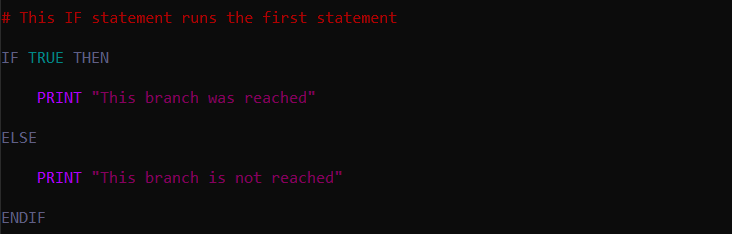
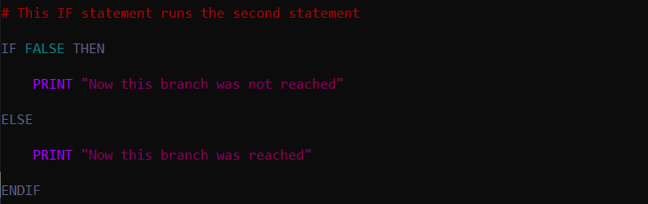
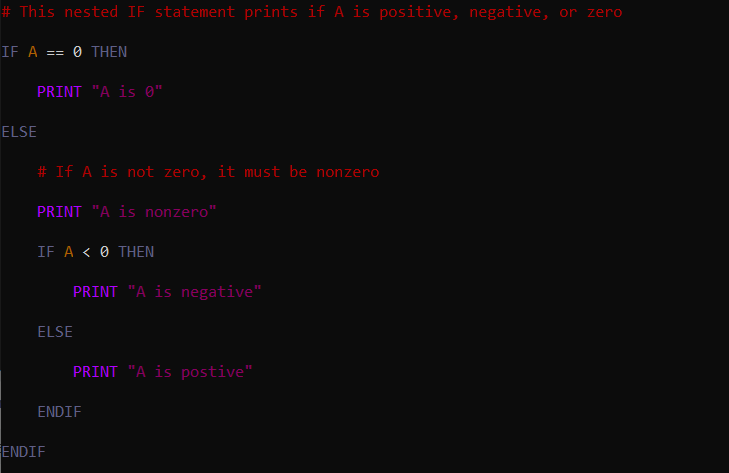
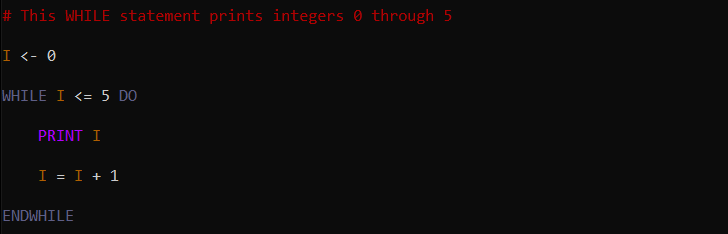
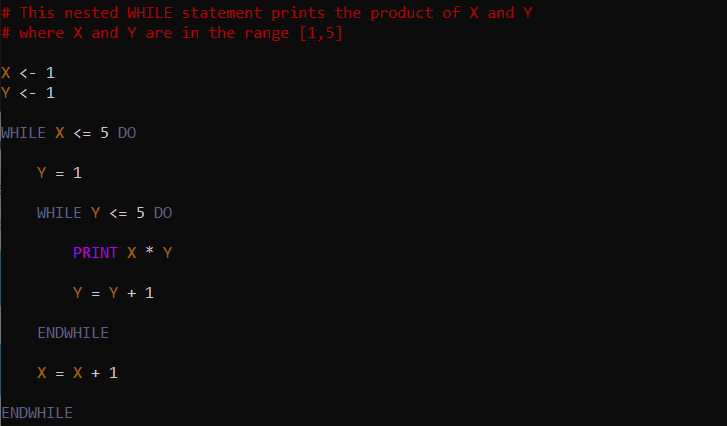
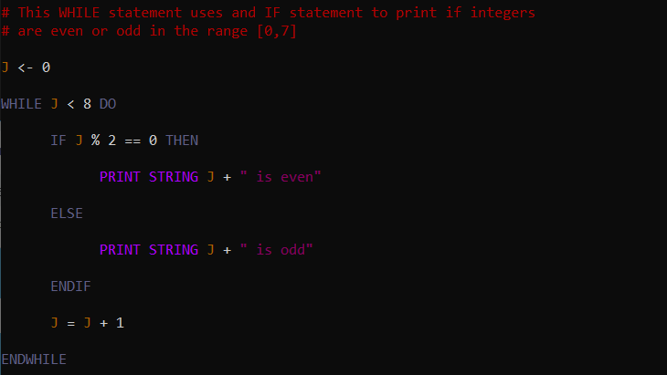

In Vidi, the fundamental control structures are `IF` statements and `WHILE` statements. These control structures function in Vidi similarly to how they function in most languages.

### If Statements

An `IF`statement is written using `IF ... THEN ... ENDIF` wherein the `IF` is succeeded by an expression that evaluates to a boolean. The `THEN` is succeeded by a statement or series of statements that are evaluated if the expression evaluates to `TRUE`. Optionally, `ENDIF` can be prepended by `ELSE ...`, `ELSE` is succeeded by a statement or series of statements which are evaluated if the expression evaluates to `FALSE`.

The following Vidi excerpt runs the first statement because `TRUE` is given.

The result of the above excerpt is `This branch was reached`

The excerpt below runs the second statement because the expression `FALSE` is given.  

The result of the above excerpt is `Now this branch was reached`  

When more than two cases are possible, nested `IF` statements can be used. The excerpt below prints different strings depending on the value of the variable `A`.

If `A` has the value `0`, `A is 0` is printed. If `A` is less than 0, then the strings `A is nonzero` and `A is negative` are printed on seperate lines. If `A` is greater than 0, then the strings `A is nonzero` and `A is positive` are printed on seperate lines.

### While Statements

An `WHILE`statement is written using `WHILE ... DO ... ENDWHILE` wherein the `WHILE` is succeeded by an expression that evaluates to a boolean. The `DO` is succeeded by a statement or series of statements that are evaluated so long as the expression evaluates to `TRUE`. The statements must be ended with `ENDWHILE`. It must be ensured that the expression will not remain `TRUE` infinitely, or else the loop will be infinite.  

The `WHILE` loop below prints the value of `I` and increments it so long as `I` is less than or equal to 5. Since `I` is initialized as 0 prior to the loop, the excerpt below results in the numbers 0 through 5 to be printed on seperate lines.

More complicated tasks can be done by nesting `WHILE` statements within `WHILE` statements. Most commonly this is done to work with multiple variables that are incremented at different rates. The excerpt below prints all of the products possible between two integers in the range 1 through 5.

Even more complicated tasks can be done by combining `WHILE` statements with `IF` statements. This is done in the excerpt below to print the parity of integers in the range 0 through 8.

