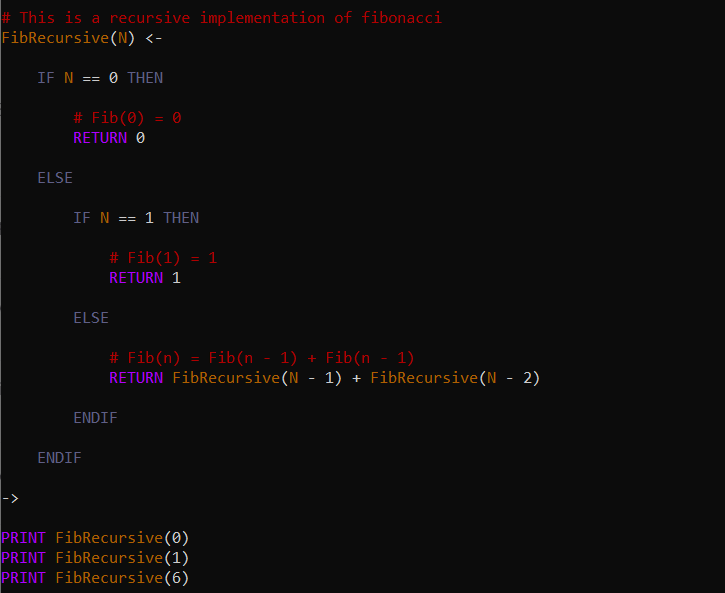
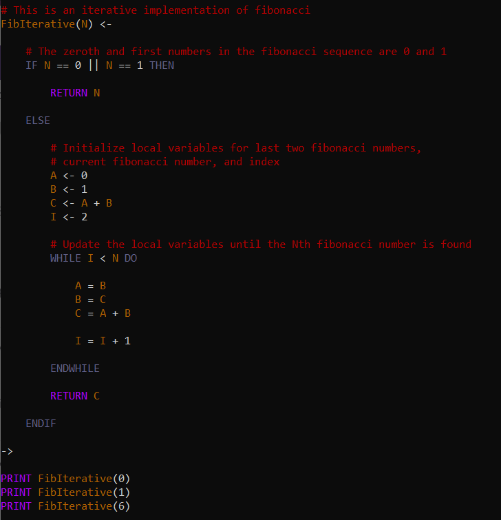

The famous fibonacci sequence is a sequence of integers that starts with 0, 1, ... and the nth number is the sum of the previous two fibonacci numbers. Calculating fibonacci numbers is intuitively done using recursion. The function below implements such as function.

The recursive approach is not optimal because many calculations are repeated. An iterative approach is slightly less intuitive but is far more optimal because each fibonacci number calculation is done only once. Such an iterative implementation is shown below.

