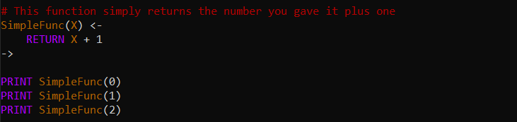
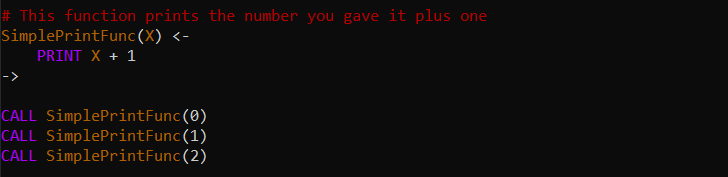
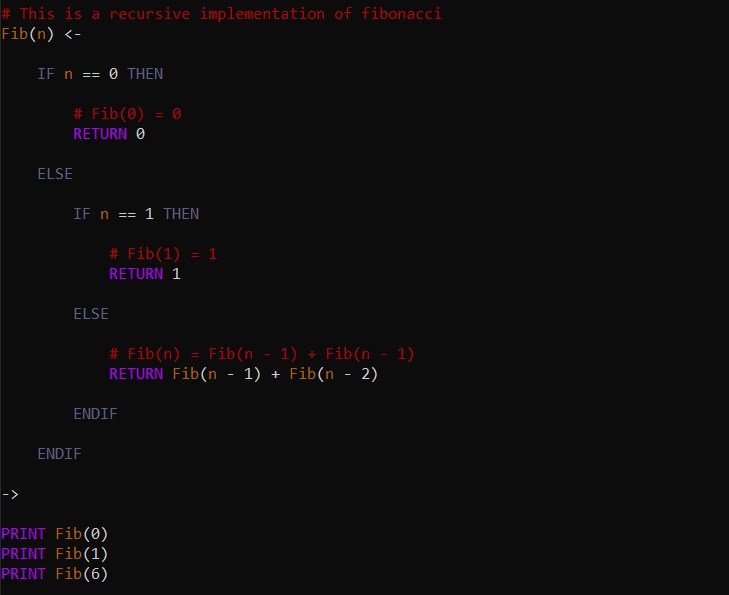

Functions in Vidi are defined in a similar fashion to variables. The main difference is that a function declaration must denote the end of the function body and give names to the function's arguments. The example below shows an example function definition as well as calling that function with different inputs.  

In the above example, the result of the function call is printed. The printed result is `1`, `2`, and `3` on seperate lines. This shows that function calls are expressions. This means you cannot simply call a function in your Vidi program because that would be an expression without a surrounding statement. This is why the `CALL` operator exists. You use `CALL` to call a function and ignore its return value. This is useful when a function has side effects such as printing. The example function below prints instead of returns, yet the printed result is the same because of the use of `CALL`.

### Recursion

In Vidi, recursive functions are defined just as any function is. In order to use recursion, you simply have to call the function you are defining within that function's definition. The example below shows an implementation of a recursive fibonacci function.

The printed result from above is `0`, `1`, and `8` on seperate lines. Although this is a good demonstration of recursion, it is important to note that using recursion for the fibonacci sequence is very inefficient. More efficient implementations, along with the one above, can be found in the fibonacci sample page.