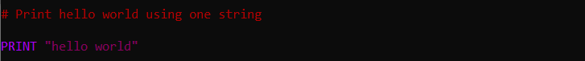
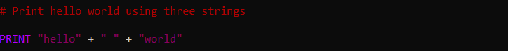
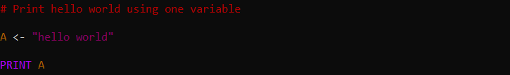
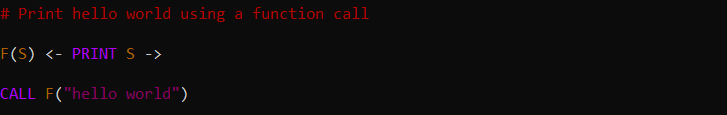

The most simple thing you can do in Vidi, or most programming languages, is print something. Here is how you print `"hello world"`. All of these excerpts print the exact string `"hello world"`, but using different method for demonstration purposes.

The most simple method:

A method demonstrating string concatenation:

Another method demonstrating using a variable:

A method showing string concatenation is still possible with variables:

Finally, a method using a simple printing function:

